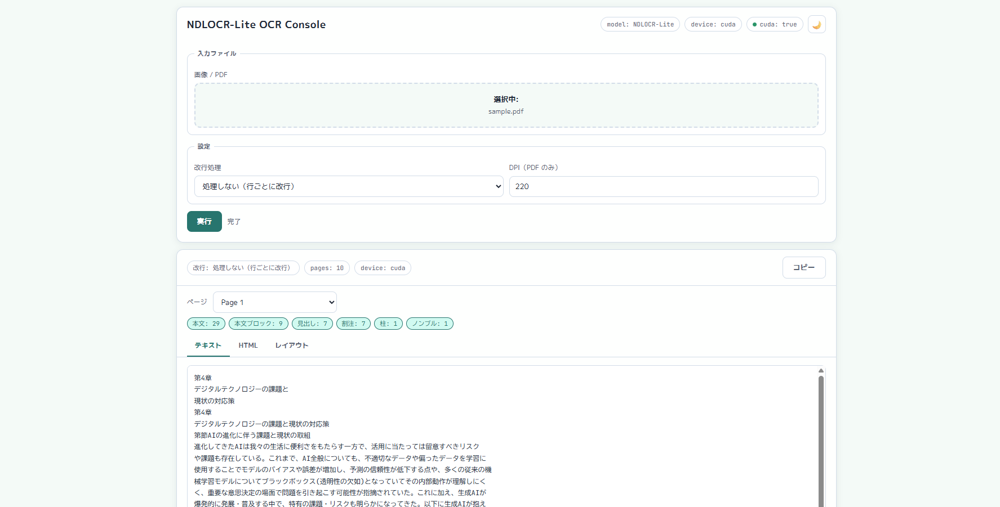

# NDLOCR-Lite Server

[ndl-lab/ndlocr-lite](https://github.com/ndl-lab/ndlocr-lite)（国立国会図書館公開、CC BY 4.0）のフォークリポジトリです。

元のリポジトリに以下の機能を追加しています。

- **PDF 対応**: PDF を直接アップロードすると自動的に画像化して OCR 処理
- **Web サーバー**: ブラウザから操作できる Web UI と JSON REST API
- **PARSEQ バッチ推論最適化**: CUDA 環境で最大 **3.7 倍**の高速化（動的バッチ + FP16）

元のリポジトリの情報（モデル詳細・OCR 結果例・学習手順・ライセンス等）は [ndl-lab/ndlocr-lite](https://github.com/ndl-lab/ndlocr-lite) を参照してください。



---

## セットアップ・起動

Python 3.10 以上が必要です。リポジトリをクローン後、付属のスクリプトを実行してください。仮想環境の作成・依存パッケージのインストール・サーバー起動をまとめて行います。

```bash
# Windows
run.bat

# macOS / Linux
bash run.sh
```

起動後、ブラウザで `http://127.0.0.1:7860` を開いてください。

## 設定

`config.toml.example` を `config.toml` にコピーして編集してください（run スクリプトが自動でコピーします）。

```bash
cp config.toml.example config.toml
```

| キー | デフォルト | 説明 |
|------|-----------|------|
| `server.host` | `"127.0.0.1"` | 待受ホスト（外部公開時は `"0.0.0.0"`） |
| `server.port` | `7860` | 待受ポート |
| `runtime.device` | `"auto"` | `"auto"`（CUDA→CPU）/ `"cuda"` / `"cpu"` |
| `processing.page_workers` | `2` | PDF 並列処理ページ数 |
| `processing.batch_inference` | `"auto"` | PARSEQ バッチ推論：`"auto"`（CUDA のみ有効）/ `"true"` / `"false"` |
| `processing.max_batch` | `16` | PARSEQ バッチサイズ上限（VRAM 使用量に影響） |
| `processing.precision` | `"auto"` | PARSEQ 推論精度：`"auto"`（CUDA→fp16、CPU→fp32）/ `"fp16"` / `"fp32"` |
| `vram.reload` | `"never"` | セッション解放モード：`"never"` / `"always"` / `"auto"` |
| `vram.reload_threshold_gb` | `0.0` | `"auto"` 時のリロード閾値 GB（0 = 無効） |
| `cpu.intra_op_threads` | `1` | CPU モード時のスレッド数（`-1` で onnxruntime 自動） |

requirements ファイルは OS に応じて自動選択されます（Windows/Linux: `requirements-gpu.txt`、macOS: `requirements-cpu.txt`）。

API リファレンス・設定リファレンス・アーキテクチャの詳細は **[dev-doc.md](./dev-doc.md)** を参照してください。

---

## このフォークについて

### 目的

ndlocr-lite はデスクトップ GUI またはコマンドラインから使うツールとして設計されており、入力は画像ファイルのみ対応していた。
このリポジトリでは以下を目的としてフォークした。

- **PDF 対応**: PDF を直接受け付け、自動的にページ画像へ変換して OCR 処理
- **ローカル Web サーバー**: ブラウザや外部ツールから HTTP 経由で OCR を利用できる環境の提供
- **CUDA バッチ推論**: PARSEQ モデルの動的バッチ化による処理速度の向上
- **FP16 推論**: PARSEQ ONNX モデルの FP16 変換（`tools/convert_fp16.py`）による追加高速化

### 加えた変更

#### 1. Web OCR サーバーの追加（`server/`）

FastAPI + Uvicorn による Web サーバーを新設した。

- ブラウザから画像・PDF をアップロードして OCR を実行できる
- JSON API を備え、外部ツールからの呼び出しにも対応
- PDF は pypdfium2 でページ画像に変換してから処理
- 複数ページを `processing.page_workers` 枚単位でチャンク処理
- DEIM 検出をチャンク内で並列実行し、全ページの行画像をまとめて 1 回の cascade batch に投入（ページ間クロスバッチ化）
- DEIM 検出器はプール管理でスレッド安全性を確保
- CUDA / cuDNN の有無を起動時に自動判定し、利用可能なら GPU に切り替え
- CUDA 起動時に全バッチサイズでウォームアップ推論を実行し、CUDA メモリアリーナを事前展開
- `vram.reload` 設定により、処理後の VRAM 使用量が閾値を超えた場合のセッション解放・再ロードをオプションで有効化

#### 2. PARSEQ モデルの動的バッチ対応（`tools/patch_dynamic_batch_v2.py`）

**背景と問題**

フォーク元の ONNX モデルはバッチサイズ=1 でエクスポートされており、複数の文字行画像を一括して GPU に投入できないため、CUDA の並列演算能力を活かせていなかった。

**なぜ再エクスポートではなくグラフ手術なのか**

PyTorch モデルを `dynamic_axes` 付きで再エクスポートする方法を試みたが、PARSEQ の AR ループはエクスポート時に完全展開（unroll）される仕様であり、生成される大量の `Where` ノードに対して onnxruntime 1.23.2 が `NOT_IMPLEMENTED` を返すため実行できない。元の ONNX ファイルにはこの問題がないため、**元グラフを直接編集する（graph surgery）** アプローチを採用した。元の重みはそのまま保持されるため、認識精度への影響はない。

**PARSEQ ONNX グラフの構造**

```
入力画像 [B, 3, H, W]
  ↓
Vision Transformer エンコーダ（12 ブロック）
  → エンコーダ出力 [B, N_patches, 192]   ← N_patches = 128 / 192 / 384（画像幅による）
  ↓
Transformer デコーダ（AR ループ × max_label_length 回、完全展開）
  各ステップ t：
    自己注意（self-attn）  ← 過去トークン列 [t, B, 192] を処理
    交差注意（cross-attn） ← エンコーダ出力を参照
    → 語彙スコア [B, vocab_size]  → ScatterND でバッファに書き込み
  ↓
リファインメントステップ（全 T トークンを一括処理）
  ↓
出力 [B, T+1, vocab_size]
```

**修正パターン**

| パターン | 対象形状 | 修正 |
|---------|---------|------|
| **A** | Reshape 定数 `[1, ...]` | `[B, ...]` に動的化 |
| **B** | Reshape 定数 `[S, 1, ...]` | `[S, B, ...]` に動的化 |
| **C** | Reshape 定数 `[S, n_h, d_h]`（n_h × d_h = 192） | `[S, B×n_h, d_h]` へ変更 |
| **CX** | Reshape 定数 `[N_H, 1, T]`（リファインメント注意マスク用） | `[B×N_H, 1, T]` へ変更 |
| **D** | Reshape 定数 `[S, 192]`（S > 1） | `[S×B, 192]` へ変更 |
| **E** | Initializer として埋め込まれた位置クエリ Q `[n_h, T, d_h]` | `Tile(Q, [B, 1, 1])` で複製 |
| **F** | `ScatterND`（AR ループの出力バッファ書き込み） | `ScatterElements(axis=1)` に置換 |
| **G** | Concat に直接渡される定数 `[1, 1]`（BOS トークン） | `Tile([1,1], [B, 1])` で複製 |

動的バッチ対応済みの `*_dynamic.onnx` はリポジトリに含まれており、CUDA 環境ではクローン後すぐにバッチ推論が有効になります。`*_dynamic.onnx` を再生成する場合（元モデルを差し替えた場合など）：

```bash
python tools/patch_dynamic_batch_v2.py
```

#### 3. `src/parseq.py` の更新

- `*_dynamic.onnx` が `src/model/` に存在する場合、自動的にそちらを読み込む
- `read_batch()` が真のバッチ推論（1 回の `session.run` 呼び出し）を実行するよう変更
- 動的モデルが存在しない場合は従来の逐次処理にフォールバック
- `max_batch` 上限を設けてバッチを分割し VRAM 消費を制限

#### 4. PARSEQ FP16 対応（`tools/convert_fp16.py`）

動的バッチ対応とは独立した、モデルの重みを FP32→FP16 に変換することによる追加高速化。

**仕組み**

`onnxconverter_common.float16.convert_float_to_float16(model, keep_io_types=True)` で `*_dynamic.onnx` の重みを FP16 化し `*_dynamic_fp16.onnx` を生成する。
`keep_io_types=True` を指定することで入出力は FP32 のままとなり、前処理・後処理の変更は不要。
NVIDIA Ampere 世代以降の GPU（RTX 30xx など）は Tensor Core により FP16 演算を FP32 の約 2 倍の速度で実行できる。

**FP16 モデルの生成**

`*_dynamic_fp16.onnx` はリポジトリに含まれており、クローン後すぐに利用可能。
再生成する場合（モデルを差し替えた場合など）：

```bash
python tools/convert_fp16.py
```

**設定**

`config.toml` の `processing.precision`：

| 値 | 動作 |
|----|------|
| `"auto"` | CUDA なら FP16、CPU なら FP32（推奨） |
| `"fp16"` | FP16 強制（CUDA + `*_dynamic_fp16.onnx` が必要） |
| `"fp32"` | FP32 強制 |

> **注意**: FP16 は動的バッチ（`*_dynamic.onnx`）と組み合わせて機能する。
> CPU では FP16 の恩恵がなく、FP32 に自動フォールバックする。

### 結果

| モデル | fp32（`*_dynamic.onnx`） | fp16（`*_dynamic_fp16.onnx`） |
|-------|------------------------|------------------------------|
| parseq-ndl-16×256-30 | 1〜64 | 1〜64 |
| parseq-ndl-16×384-50 | 1〜64 | 1〜64 |
| parseq-ndl-16×768-100 | 1〜64 | 1〜64 |

検証環境：Intel Core i7-14700K / NVIDIA GeForce RTX 3060 12GB

**PARSEQ マイクロベンチマーク**（行画像 16 枚、`tools/benchmark_batch.py`）

| 環境 | モード | 16 行あたり | 1 行あたり | 対 CPU 逐次比 |
|------|-------|------------|-----------|--------------|
| CPU  | 逐次処理 | 335 ms | 20.9 ms | 1.0× |
| CPU  | バッチ推論 fp32（batch=16） | 257 ms | 16.1 ms | 1.3× |
| CUDA | 逐次処理 | 160 ms | 10.0 ms | 2.1× |
| CUDA | バッチ推論 fp32（batch=16） | 52 ms | 3.2 ms | **6.4×** |
| CUDA | バッチ推論 fp16（batch=16）※ | ~43 ms | ~2.7 ms | **~7.8×** |

※ fp16 は PDF 64 ページの全体処理時間（71 s vs fp32 86 s）から換算した推定値。

**PDF 全体処理（64 ページ、page\_workers=5、max\_batch=64、CUDA）**

| 精度 | 処理時間 | 高速化率（対 fp32） |
|------|---------|-------------------|
| FP32 | 86 s | 1.0× |
| FP16 | 71 s | **1.21×** |

2 つの最適化（動的バッチ + FP16）を組み合わせることで、CUDA 環境では CPU 逐次処理と比べて最大約 **3.7 倍**（CUDA バッチ内での比較）の高速化が得られる。
